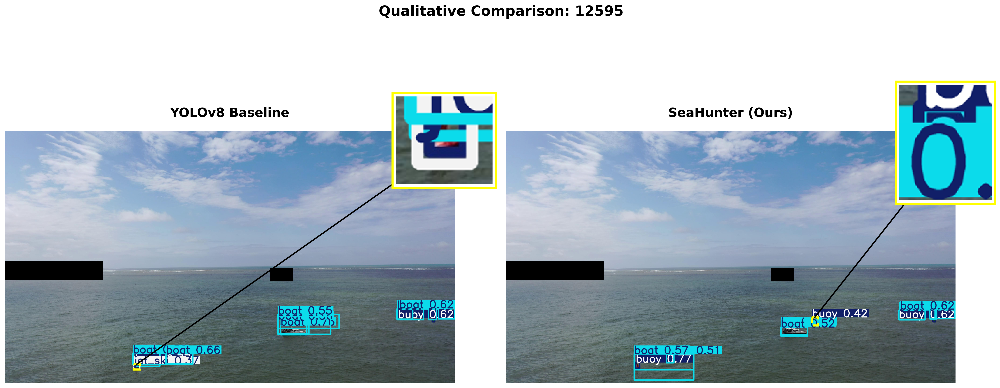
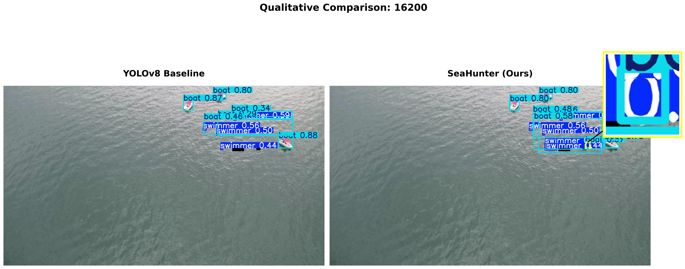
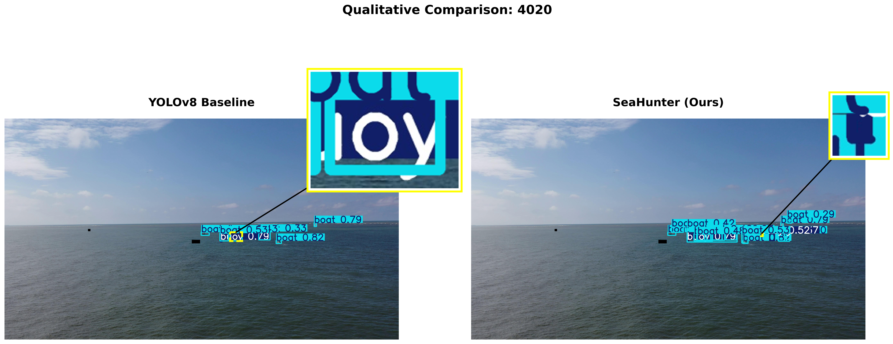

# 🌊 SeaHunter: Maritime Object Detection for Search and Rescue

[](https://www.python.org/)
[](https://pytorch.org/)
[](LICENSE)

> **A High-Precision YOLOv8s-based Network with Multi-Scale Context Aggregation for Tiny Maritime Object Detection**

SeaHunter is a specialized object detector designed for maritime search and rescue (SAR) operations using UAVs. It achieves **state-of-the-art performance** on the SeaDronesSee dataset with **82.2% mAP@0.5** and **78.2% Recall**, significantly outperforming baseline YOLOv8s.

---

## 🎯 Key Features

- **🔍 P2 Detection Head**: High-resolution features for detecting tiny objects (as small as 10×10 pixels)
- **🎨 SPD-Conv**: Lossless space-to-depth downsampling preserving fine-grained features
- **🌊 MultiSEAM Module**: Multi-scale context aggregation suppressing wave interference
- **⚡ EMA Attention**: Efficient multi-scale attention with GroupNorm optimization
- **📐 NWD Loss**: Normalized Wasserstein Distance for stable tiny object regression

---

## 📊 Performance

| Model | mAP@0.5 | Recall | Precision | FPS | GFLOPs |
|-------|---------|--------|-----------|-----|--------|
| YOLOv8s (Baseline) | 76.8% | 70.2% | 75.3% | 95 | 28.6 |
| RT-DETR-l | 79.2% | - | - | 35 | 110.0 |
| **SeaHunter (Ours)** | **82.2%** | **78.2%** | **84.7%** | 55 | 45.2 |

**Improvements over Baseline:**
- ✅ **+5.4%** mAP@0.5
- ✅ **+8.0%** Recall (critical for reducing missed detections)
- ✅ **+9.4%** Precision

---

## 🖼️ Visual Results

### Qualitative Comparison
<p align="center">
  
  
  
</p>

**Left:** YOLOv8 Baseline | **Right:** SeaHunter
Yellow boxes highlight zoomed-in regions showing SeaHunter's superior capability in detecting extremely small targets under challenging conditions (sun glint, dense objects, wave interference).

---

## 🚀 Quick Start

### 1. Requirements: Software

#### System Requirements
- **Python:** 3.8 / 3.9 / 3.10
- **CUDA:** 11.8 (for GPU acceleration)
- **GPU:** NVIDIA RTX 4060 or similar (8GB+ VRAM recommended)
- **RAM:** 16GB minimum

#### Install Dependencies
```bash
# Clone the repository
git clone https://github.com/zse04152005-del/SeaHunter-Maritime-Detection.git
cd SeaHunter-Maritime-Detection

# Install PyTorch with CUDA 11.8
pip install torch==2.0.1 torchvision==0.15.2 --index-url https://download.pytorch.org/whl/cu118

# Install other dependencies
pip install -r requirements.txt
```

⚠️ **IMPORTANT:** This project uses a **MODIFIED** version of Ultralytics YOLOv8 located in `yolo_source/`. **DO NOT** install `ultralytics` from PyPI. See [Code Modifications](#-code-modifications) section for details.

---

### 2. Pretrained Models

Download the SeaHunter pretrained weights:

| Model | Size | mAP@0.5 | Download Link |
|-------|------|---------|---------------|
| **SeaHunter (best.pt)** | 62 MB | 82.2% | [Google Drive](#) / [百度网盘](#) |
| YOLOv8s Baseline | 22 MB | 76.8% | [Ultralytics](https://github.com/ultralytics/assets/releases/download/v0.0.0/yolov8s.pt) |

**Directory Structure After Download:**
```
SeaHunter-Maritime-Detection/
├── weights/
│   ├── seahunter_best.pt          # ⬅️ Place downloaded model here
│   └── yolov8s.pt                 # Baseline (optional)
├── yolo_source/                    # Modified YOLOv8 source code
├── run_ablation.py                 # Training script
└── test_seahunter.py               # Inference script
```

---

### 3. Preparation for Testing

#### Option A: Quick Inference on Single Image
```bash
python test_seahunter.py --weights weights/seahunter_best.pt --source path/to/your/image.jpg
```

#### Option B: Inference on Directory
```bash
python test_seahunter.py --weights weights/seahunter_best.pt --source path/to/images/folder/
```

#### Option C: Use in Python Script
```python
from ultralytics import YOLO

# Load SeaHunter model
model = YOLO('weights/seahunter_best.pt')

# Run inference
results = model.predict(
    source='path/to/image.jpg',
    imgsz=1024,              # SeaHunter uses 1024x1024 input
    conf=0.25,               # Confidence threshold
    iou=0.7                  # NMS IoU threshold
)

# Display results
results[0].show()
```

---

## 🛠️ Code Modifications

**This project requires a MODIFIED version of Ultralytics YOLOv8.** The following custom modules have been added to `yolo_source/ultralytics/`:

### Modified Files

#### 1. **`yolo_source/ultralytics/nn/modules/block.py`** (Lines 1971-2081)
Added three custom modules:

**SPDConv (Space-to-Depth Convolution):**
```python
class SPDConv(nn.Module):
    """Lossless downsampling via space-to-depth transformation"""
    def forward(self, x):
        # Split into 4 sub-patches: [::2,::2], [1::2,::2], [::2,1::2], [1::2,1::2]
        x = torch.cat([x[..., ::2, ::2], x[..., 1::2, ::2],
                       x[..., ::2, 1::2], x[..., 1::2, 1::2]], 1)
        return self.act(self.bn(self.conv(x)))
```

**EMA (Efficient Multi-Scale Attention):**
```python
class EMA(nn.Module):
    """Multi-scale channel attention with GroupNorm for small batch sizes"""
    def __init__(self, c1, c2, factor=32):
        super().__init__()
        self.groups = factor
        self.gn = nn.GroupNorm(c1 // self.groups, c1 // self.groups)
        # ... (see full implementation in code)
```

**MultiSEAM (Multi-Scale Separation and Enhancement Attention Module):**
```python
class MultiSEAM(nn.Module):
    """Multi-scale context aggregation for wave interference suppression"""
    def __init__(self, c1, c2, depth=1, kernel_size=3,
                 patch_size=[3, 5, 7], reduction=16):
        # Multi-branch design with different patch sizes (3x3, 5x5, 7x7)
        # ... (see full implementation in code)
```

#### 2. **`yolo_source/ultralytics/nn/modules/__init__.py`**
Register custom modules:
```python
from .block import SPDConv, EMA, MultiSEAM

__all__ = [..., 'SPDConv', 'EMA', 'MultiSEAM']
```

#### 3. **`yolo_source/ultralytics/nn/tasks.py`**
Add module parsing logic in `parse_model()` function to recognize `SPDConv`, `EMA`, and `MultiSEAM` in YAML configuration files.

### Model Configuration

The final SeaHunter architecture is defined in:
```
yolo_source/ultralytics/cfg/models/v8/yolov8s_p2_seahunter.yaml
```

**Key Architecture Components:**
- **Backbone:** SPDConv (layers 3, 5, 7) + MultiSEAM (layer 9) + EMA (layer 10)
- **Neck:** Standard C2f with FPN/PAN structure
- **Head:** 4-level detection (P2/P3/P4/P5) for multi-scale tiny objects

---

## 📦 Dataset Preparation

This project uses the **SeaDronesSee Object Detection v2** dataset.

### Download Dataset
```bash
# Create dataset directory
mkdir -p datasets/SeaDronesSee

# Download from official source
# https://seadronessee.cs.uni-tuebingen.de/
```

### Dataset Structure
```
datasets/SeaDronesSee/
├── images/
│   ├── train/          # 3,661 images (70%)
│   ├── val/            # 1,046 images (20%)
│   └── test/           # 523 images (10%)
└── labels/
    ├── train/
    ├── val/
    └── test/
```

### Configuration File
Create `seadrones_local.yaml` in project root:
```yaml
path: ./datasets/SeaDronesSee
train: images/train
val: images/val
test: images/test

nc: 5  # Number of classes
names: ['swimmer', 'boat', 'jetski', 'life_saving_appliances', 'buoy']
```

---

## 🏋️ Training

### Train SeaHunter from Scratch
```bash
python run_ablation.py
```

This script will:
1. Load YOLOv8s pretrained weights
2. Initialize SeaHunter architecture (P2 + SPD + MultiSEAM + EMA)
3. Train for 150 epochs at 1024×1024 resolution
4. Save results to `runs/detect_seahunter/8_SeaHunter_Final/`

### Training Parameters (Optimized for RTX 4060)
```python
epochs=150
imgsz=1024
batch=4              # Reduce to 2 if OOM error occurs
optimizer='SGD'
lr0=0.01
momentum=0.937
weight_decay=0.0005
```

### Training Monitoring
- **Metrics:** Automatically logged to `runs/detect_seahunter/8_SeaHunter_Final/results.csv`
- **Visualizations:** Training curves, confusion matrix, PR curve saved in the same directory

---

## 📈 Evaluation

### Evaluate on Test Set
```bash
from ultralytics import YOLO

model = YOLO('weights/seahunter_best.pt')
metrics = model.val(
    data='seadrones_local.yaml',
    split='test',
    imgsz=1024
)

print(f"mAP@0.5: {metrics.box.map50:.3f}")
print(f"mAP@0.5:0.95: {metrics.box.map:.3f}")
print(f"Recall: {metrics.box.recall:.3f}")
print(f"Precision: {metrics.box.precision:.3f}")
```

---

## 📄 Citation

If you use SeaHunter in your research, please cite:

```bibtex
@article{seahunter2025,
  title={SeaHunter: A High-Precision YOLOv8s Network with Multi-Scale Context Aggregation for Tiny Maritime Object Detection},
  author={Zhang, Shien and Zhou, Hongjie},
  journal={Computer Vision Course Project},
  institution={Macau University of Science and Technology},
  year={2025}
}
```

---

## 📂 Project Structure

```
SeaHunter-Maritime-Detection/
├── README.md                          # This file
├── requirements.txt                   # Python dependencies
├── .gitignore                         # Git ignore configuration
├── CODE_MODIFICATIONS.md              # Detailed code modification guide
│
├── weights/                           # Model weights (download separately)
│   └── seahunter_best.pt
│
├── yolo_source/                       # Modified Ultralytics YOLOv8 source
│   └── ultralytics/
│       ├── cfg/models/v8/
│       │   └── yolov8s_p2_seahunter.yaml  # SeaHunter architecture config
│       └── nn/modules/
│           └── block.py               # Custom modules (SPD, EMA, MultiSEAM)
│
├── run_ablation.py                    # Training script
├── test_seahunter.py                  # Inference script
├── seadrones_local.yaml               # Dataset configuration
│
├── datasets/                          # Dataset directory (not included)
│   └── SeaDronesSee/
│
├── runs/                              # Training results (auto-generated)
│   └── detect_seahunter/
│       └── 8_SeaHunter_Final/
│
└── paper_visualizations/              # Figures from paper
    ├── figure_A_*.png
    ├── figure_B_*.png
    └── figure_C_*.png
```

---

## 🙏 Acknowledgments

- **YOLOv8 Framework:** [Ultralytics](https://github.com/ultralytics/ultralytics)
- **Dataset:** [SeaDronesSee](https://seadronessee.cs.uni-tuebingen.de/)
- **Institution:** Macau University of Science and Technology
- **Course:** CS460/EIE460/SE460 Computer Vision

---

## 📧 Contact

- **Authors:** Zhang Shien (1230015451), Zhou Hongjie (1230020467)
- **GitHub:** [SeaHunter-Maritime-Detection](https://github.com/zse04152005-del/SeaHunter-Maritime-Detection)
- **Issues:** Please report bugs via [GitHub Issues](https://github.com/zse04152005-del/SeaHunter-Maritime-Detection/issues)

---

## 📜 License

This project is released under the MIT License. See [LICENSE](LICENSE) file for details.
