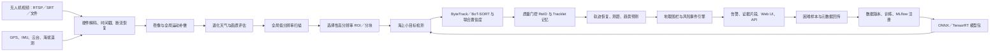

# SeaHunter-VIS 完整开发流程与任务大纲

> 文档状态：执行中
> 项目代号：SeaHunter-VIS
> 原始基线：SeaHunter-Maritime-Detection
> 文档用途：本文件是项目范围、实施顺序、阶段门禁和验收标准的唯一执行依据。

## 1. 项目目标

将现有 SeaHunter 单帧海上小目标检测原型升级为可长期运行、可追踪、可解释、可部署、可回放评估的海上无人机视频智能感知系统。

首版系统需要覆盖：

- 海上无人机视频微小目标检测；
- 多目标跟踪、短时轨迹恢复和遮挡后重捕获；
- 目标地理位置、距离、速度与运动趋势估计；
- 危险区域进入、逗留、快速接近等事件预警；
- NVIDIA 边缘设备上的实时推理；
- 低照度、雾、眩光、海浪和尾流等退化条件鲁棒性测试；
- 数据版本、实验记录、模型注册、灰度发布和回滚；
- 告警证据视频、轨迹和模型版本的完整追溯。

## 2. 首版边界

### 2.1 纳入范围

- 单架无人机、单路可见光视频；
- RTSP、SRT、本地视频和离线数据集回放；
- GPS、IMU、无人机高度和云台姿态遥测；
- `swimmer`、`boat`、`jetski`、`life_saving_appliances`、`buoy` 五类目标；
- 单设备实时推理和中心端模型管理；
- 人在回路的辅助决策与告警确认。

### 2.2 暂不纳入首版

- 多无人机跨相机全局 ID；
- 热红外与可见光融合；
- AIS、雷达和声呐深度融合；
- 自主飞行控制或自动救援决策；
- 无遥测条件下的米级绝对测距承诺。

上述能力可在 V2 中扩展，但不能阻塞 V1 的完成。

## 3. 核心原则

1. **先系统、后创新**：先建立视频基线、评测和边缘运行时，再引入研究模块。
2. **视频级评估**：禁止把同一视频相邻帧随机拆到训练集和测试集。
3. **不确定度显式化**：检测、跟踪、轨迹恢复和测距均输出质量或协方差。
4. **不伪造轨迹**：恢复点必须标记为 `inferred`，长时间丢失不得无界外推。
5. **接口隔离框架**：业务层不得直接依赖 Ultralytics `Results` 对象。
6. **部署约束前置**：新算子进入主分支前必须通过 ONNX 和 TensorRT 可导出验证。
7. **指标可追溯**：每个实验绑定 Git 提交、数据版本、配置、随机种子和环境镜像。
8. **安全优先**：危险告警采用轨迹级判定、滞回、去重和人工确认。
9. **离线可运行**：网络断开不影响边缘检测、跟踪、告警和本地证据保存。
10. **许可证先决**：商业交付前解决内置 Ultralytics AGPL-3.0 与项目许可边界。

## 4. 总体架构



## 5. 标准数据契约

以下结构需要先稳定，算法模块通过结构化对象交互：

- `FramePacket`：帧 ID、源 ID、采集时间、解码时间、图像和丢帧状态；
- `TelemetryPacket`：GPS、海拔、IMU、云台角度、时间戳和质量标志；
- `Detection`：框、类别、检测置信度、尺度层、ROI 来源和退化标签；
- `TrackState`：Track ID、观测/推断状态、速度、协方差、年龄和匹配分数；
- `GeoEstimate`：经纬度、局部坐标、距离、方位和估计质量；
- `RiskEvent`：事件 ID、规则、区域、风险级别、生命周期和证据引用；
- `ModelManifest`：模型版本、标签、预处理、输入尺寸、引擎、校准集和评测指标。

任何字段变化都需要兼容性说明和测试。

## 6. 阶段路线图

### M0：基线冻结与工程治理

**目标**：让原始检测器可复现、可测试、可审计，并为新系统建立可靠起点。

任务：

- [x] 保留原始 Git 历史并创建升级分支；
- [x] 记录原项目文件、权重、数据和自定义源码的来源；
- [x] 将论文和历史图表迁移到 `docs/archive/`；
- [x] 识别并删除缓存、重复依赖和明确无用文件；
- [x] 冻结 Ultralytics 版本和第三方许可证清单；
- [x] 修复训练脚本本地包加载不一致；
- [x] 将 NWD 真正接入 bbox loss，或从模型声明中移除；
- [x] 将单个伪“消融脚本”改成配置驱动实验入口；
- [x] 建立 `pyproject.toml`、锁定依赖、代码格式和测试配置；
- [x] 建立 GitHub Actions 或等价 CI；
- [x] 添加自定义模块形状、梯度、奇数尺寸和导出测试；
- [x] 建立原始权重离线推理烟雾测试；
- [x] 建立风险、决策和变更日志。

交付物：

- 可安装的本地 Python 包；
- 基线检测器配置、权重清单和环境清单；
- 自动化测试和真实消融配置；
- `docs/BASELINE_AUDIT.md`；
- `THIRD_PARTY_NOTICES.md`；
- M0 测试报告。

验收门禁：

- 新环境中不依赖全局 PyPI Ultralytics 即可加载模型；
- NWD 有调用路径、梯度测试和开关配置；
- 自定义模块前向/反向测试通过；
- 原始样例输出与基线在允许误差内一致；
- 工作树无生成文件和未记录的大型数据。

### M1：视频流检测 MVP

**目标**：建立不会无限积压、可断流恢复、可离线回放的实时视频流水线。

任务：

- [x] 设计视频源抽象：文件、USB、RTSP、SRT；
- [ ] 使用 GStreamer/FFmpeg，优先 NVDEC 硬件解码；BLOCKED：后端选择、能力报告与软件回退已通过云端验证，实际 NVDEC 仍需 NVIDIA 目标设备；
- [x] 实现有界帧队列和“丢旧保新”策略；
- [x] 实现采集时间、解码时间和推理时间统计；
- [x] 实现 RTSP 超时、指数退避重连和坏帧处理；
- [x] 实现流式检测器接口；
- [x] 实现确定性 JSONL 元数据输出；
- [x] 实现 Parquet 批量评测元数据输出；
- [x] 实现带框视频和基础 WebSocket 预览；
- [x] 建立固定视频回放和性能基准工具；
- [x] 增加队列、解码/推理延迟和掉帧监控；
- [x] 增加进程内存、GPU 显存、功耗和温度监控。

交付物：

- `edge_service` 原型；
- 视频回放 CLI；
- 单路视频实时检测演示；
- 性能与断流恢复报告。

验收门禁：

- 长视频使用流式结果，不随帧数线性增长内存；
- 断流后自动恢复且服务不退出；
- 1080p 视频端到端 P95 延迟和 FPS 可持续记录；
- 离线回放相同输入产生确定性元数据。

### M2：多目标跟踪、遮挡重捕获与轨迹恢复

**目标**：形成适应移动无人机和微小目标的视频级稳定轨迹。

当前进度（2026-07-30）：ByteTrack 两阶段关联、Kalman 运动模型、轨迹生命周期、短时预测、MOT/审计
JSONL 输出及 CLI 已完成，并通过 GitHub Actions 的 Python 3.10/3.12 常规矩阵、M2 跟踪专项、M1 回放
集成及原始权重 CPU 回归。Track ID、生命周期、有限轨迹线以及 `observed`/`inferred` 差异化视频与
WebSocket 可视化也已通过云端验证。

MOT 指标评测代码已接入固定提交的官方 TrackEval，实现 class-agnostic MOTChallenge 适配、HOTA/CLEAR/
Identity 指标归一化报告及逐帧错误索引。Python 3.10/3.12 常规矩阵和 M2 评测专项均已通过；合成数据
仅用于验证指标接线与已知错误计数，不作为真实海域跟踪质量结论。

BoT-SORT 运动分支与视觉 GMC 已通过 Python 3.10/3.12 常规矩阵及 M2 GMC 专项云端验收：实现前景框
屏蔽的稀疏光流、RANSAC 仿射估计、质量与运动合理性回退门控、逐帧审计字段，以及保持其余参数一致
的无 GMC/有 GMC 合成平移消融。合成序列 ID Switch 从 3 降至 0，仅用于接线与已知行为验证；真实海域
收益门禁仍保持开放。质量门控 ReID 外观分支已完成云端接线验收，但真实海域阈值、编码器和收益门禁
仍保持开放。

任务：

- [x] 建立 ByteTrack 基线；
- [x] 接入 BoT-SORT 和视觉全局运动补偿；
- [x] 使用 IMU/云台运动先验辅助稳像；
- [x] 建立分层关联：高分检测、低分检测、运动门控、ReID；
- [x] 建立 ReID 质量门控；
- [x] 聚合 Tracklet 中清晰帧形成外观模板；
- [x] 对极小目标优先使用运动和世界坐标，而非强行 ReID；
- [x] 建立短时遮挡轨迹插值和有限外推；
- [x] 为每个轨迹点标记 `observed` 或 `inferred`；
- [x] 输出轨迹协方差和丢失原因；
- [x] 建立 MOT 格式评测和可视化。

交付物：

- ByteTrack/BoT-SORT 可切换跟踪器；
- 全局运动补偿模块；
- ReID 和轨迹恢复模块；
- HOTA、IDF1、AssA、ID Switch、Fragmentation 报告。

验收门禁：

- 相比无 GMC 基线，移动镜头 ID Switch 有明确下降；
- 不合格小目标不会进入 ReID 分支；
- 恢复轨迹可在结果中被单独过滤；
- 失配和重捕获可通过回放定位到具体帧。

### M3：测距、地理定位与运动趋势

**目标**：将像素轨迹转为带质量评估的距离、方位和运动趋势。

任务：

- [x] 定义相机内参、畸变和外参标定流程；
- [x] 接入 MAVLink 或实际无人机遥测格式；
- [x] 完成视频与遥测时钟同步和延迟标定；
- [x] 建立 ENU/NED、相机、云台和图像坐标转换；
- [x] 使用视线与海平面相交估算地理位置；
- [x] 处理海拔、潮位、浪高和姿态误差；
- [x] 使用 EKF/UKF 平滑位置、速度与协方差；
- [x] 输出接近、远离、横向和静止趋势；
- [x] 输出 TTC，并在低质量时降级为相对趋势；
- [ ] 使用 RTK、AIS、测距仪或已知标志物建立真值集。

交付物：

- 相机标定工具；
- 遥测同步器；
- 地理投影、距离和趋势模块；
- 不同距离/姿态/海况分层误差报告。

验收门禁：

- 没有遥测时明确降级，不输出伪绝对距离；
- 每个距离结果包含质量值；
- 标定范围内达到冻结后的 MAE/相对误差要求；
- 时间同步误差能被监控和告警。

### M4：危险区域与事件闭环

**目标**：将轨迹转为稳定、可追溯、低重复的风险事件。

任务：

- [ ] 使用经纬度或局部海平面多边形定义区域；
- [ ] 支持进入、离开、逗留、接近、逆向和碰撞趋势；
- [ ] 引入进入/退出滞回、最短停留和冷却期；
- [ ] 建立轨迹可靠度、TTC、目标类型和区域等级风险评分；
- [ ] 建立 `open/update/acknowledged/closed` 生命周期；
- [ ] 保存告警前后环形视频、轨迹、遥测和模型版本；
- [ ] 提供 REST/WebSocket/MQTT 输出；
- [ ] 提供操作员确认、误报标记和反馈回流。

交付物：

- 地理围栏编辑与校验；
- 规则和风险引擎；
- 事件 API、证据包和基础 UI；
- 事件级 Precision/Recall 和误告警/小时报告。

验收门禁：

- 单帧抖动不会触发事件；
- 重启后未关闭事件可恢复；
- 每次告警能追溯输入、轨迹、规则和模型版本；
- 误报反馈能够进入困难样本池。

### M5：数据闭环、鲁棒性与半监督训练

**目标**：建立真实海域数据飞轮，解决低照、雾、眩光和海浪硬负样本。

任务：

- [ ] 制定检测、Track ID、遮挡、天气、海况和事件标注规范；
- [ ] 按航次、日期、地点划分训练/验证/测试；
- [ ] 建立像素尺寸分桶和长尾类别报告；
- [ ] 建立海浪、尾流、鸟、泡沫、反射等硬负样本集；
- [ ] 构造真实与合成退化强度分级；
- [ ] 建立主动学习：低置信、分歧、断轨和误告警采样；
- [ ] 建立教师-学生半监督基线；
- [ ] 使用时间一致性和 Tracklet 一致性过滤伪标签；
- [ ] 进行置信度校准和天气分层阈值评估；
- [ ] 使用 DVC/lakeFS 管数据，MLflow 管实验和模型。

交付物：

- 数据字典、标注指南和数据审计报告；
- 正常/低照/雾/眩光/高浪测试矩阵；
- 半监督训练配置和伪标签审计工具；
- 模型卡和数据卡。

验收门禁：

- 测试集无视频或航次泄漏；
- 每个天气条件均有独立指标；
- 半监督提升在独立测试集成立，且误告警未显著增加；
- 所有结果能由数据版本和 Git 提交复现。

### M6：核心创新研发

**目标**：在完整基线上发展少而强、可消融、可部署的创新模块。

#### M6.1 选择性高分辨率感知（P0）

- [ ] 低分辨率全局扫描；
- [ ] 基于 objectness、运动残差、历史轨迹和丢失轨迹生成 ROI；
- [ ] Top-K 高分辨率细查；
- [ ] 周期性全局刷新避免盲区；
- [ ] 跨尺度融合和边界目标去重；
- [ ] 根据延迟、温度和队列动态调节 K 与分辨率；
- [ ] 对比全帧 1024、固定切片和选择性 ROI 的精度/延迟。

#### M6.2 时序小目标动态监测头（P0）

- [ ] 在稳像特征上计算多帧变化；
- [ ] 融合当前空间特征、运动残差和历史特征；
- [ ] 对相机运动、海浪周期运动和真实目标运动进行区分；
- [ ] 保持有限状态，支持断流和场景切换时清空；
- [ ] 对比单帧头、帧差分和时序头。

#### M6.3 检测与跟踪联合置信度（P0）

- [ ] 融合检测概率、轨迹先验、运动一致性、ReID 和状态不确定度；
- [ ] 使用温度缩放或等价方法校准检测概率；
- [ ] 对周期性海浪假目标加入背景/运动否决；
- [ ] 评估低置信目标召回、误报持续时间和断轨率；
- [ ] 禁止仅凭重复出现无限抬升置信度。

#### M6.4 频域与空间域联合降采样（P1）

- [ ] 优先评估可导出的固定高低通、DWT 或抗混叠卷积；
- [ ] 避免依赖复杂 FFT/复数算子进入首版边缘引擎；
- [ ] 对比 SPDConv、标准步长卷积和联合降采样；
- [ ] 单独统计超小目标、海浪硬负样本和 TensorRT 延迟。

#### M6.5 退化天气路由与 Sim2Real（P2）

- [ ] 先训练单一鲁棒模型；
- [ ] 训练轻量退化类型/强度分类器；
- [ ] 先路由预处理与阈值配置，再考虑路由完整专家模型；
- [ ] 路由按视频片段而非逐帧抖动切换；
- [ ] 只有真实数据覆盖不足时才引入 Sim2Real；
- [ ] 专家收益必须覆盖显存、切换和维护成本。

创新验收门禁：

- 每个创新有独立开关和独立消融；
- 使用至少 3 个随机种子报告均值和标准差；
- 同时报告精度、误报、参数量、FLOPs、显存和 TensorRT 延迟；
- 不以不可部署算子换取只在训练环境成立的提升；
- 组合模型的收益大于单模块收益波动。

### M7：ONNX/TensorRT 与边缘产品化

**目标**：在目标硬件上形成稳定、可升级和可回滚的实时系统。

任务：

- [ ] 导出动态/静态 shape ONNX 并进行数值一致性测试；
- [ ] 构建 TensorRT FP16 引擎；
- [ ] 使用真实海况校准集评估 INT8；
- [ ] 将视频链路迁移到 DeepStream/C++ 或等价高性能运行时；
- [ ] 使用 NVDEC、CUDA stream 和预分配内存；
- [ ] 建立热降频、显存不足和推理超时降级策略；
- [ ] 模型包签名并包含完整 `ModelManifest`；
- [ ] 支持灰度部署、健康检查、失败回滚；
- [ ] 完成 8 小时性能测试和 72 小时稳定性测试；
- [ ] 测试断网、断流、坏帧、时钟漂移和进程重启。

交付物：

- ONNX 和 TensorRT 引擎；
- Jetson/边缘设备镜像；
- 性能预算和热稳定报告；
- 部署、升级、回滚和故障手册。

验收门禁：

- PyTorch、ONNX、TensorRT 输出在允许误差内一致；
- 目标设备达到冻结后的 FPS、P95 延迟和功耗要求；
- 72 小时无不可恢复异常或持续内存增长；
- 模型升级失败能自动回滚。

### M8：海试、验收与发布

**目标**：证明系统在真实地点、真实天气和真实操作流程中可用。

任务：

- [ ] 至少覆盖多个地点、时间段、高度和海况；
- [ ] 执行正常、低照、雾、眩光和高浪场景矩阵；
- [ ] 组织操作员盲测和告警确认；
- [ ] 验证摄像机标定、遥测同步和区域配置流程；
- [ ] 统计误报/小时、漏警、重捕获和距离误差；
- [ ] 验证日志、证据包、模型版本和事件审计；
- [ ] 完成安全、隐私、许可证和运维评审；
- [ ] 冻结 V1.0 模型、引擎、镜像和文档。

交付物：

- 海试报告和问题闭环；
- V1.0 发布包；
- 用户、部署、运维和模型卡文档；
- V2 需求池。

## 7. 统一评测指标

### 7.1 检测

- mAP50、mAP50-95、AP_small；
- 按目标短边像素分桶的 Recall；
- 固定误报率下的 Recall；
- 每小时误检数；
- 置信度 ECE 和可靠性曲线；
- 按类别、天气、海况、距离和分辨率分层。

### 7.2 跟踪与重识别

- HOTA、DetA、AssA、IDF1、MOTA；
- ID Switch、Fragmentation；
- 轨迹召回率和平均断轨时长；
- 不同遮挡长度下的重捕获率；
- 恢复轨迹 ADE/FDE；
- 外观质量门控命中率。

### 7.3 测距与趋势

- 距离 MAE、RMSE 和相对误差；
- 方位误差；
- 世界坐标 ADE/FDE；
- 接近/远离/横向趋势 F1；
- TTC 误差；
- 不确定度覆盖率。

### 7.4 事件与系统

- 事件 Precision、Recall、F1；
- 误告警/通道/小时；
- 告警端到端延迟和重复率；
- P50/P95/P99 延迟、FPS、掉帧率；
- CPU/GPU/显存/功耗/温度；
- 断流恢复时间、72 小时可用性。

## 8. 初始验收目标

以下为启动目标，M1/M2 获取真实基线后再冻结：

- 正常天气下，目标短边不小于 8 px 时关键类别 Recall 不低于 90%；
- 告警误报不超过 1 次/通道/小时；
- 不超过 2 秒遮挡的重捕获率不低于 80%；
- 标定有效范围内距离中位相对误差不高于 15%；
- 1080p 单路边缘端持续不低于 20 FPS；
- 端到端 P95 延迟不高于 150 ms；
- 72 小时无显存泄漏和不可恢复断流。

若某项指标受硬件、目标尺寸或真值条件限制，必须记录前提并通过评审调整，不能静默降低。

## 9. 数据与实验流程

每次模型实验必须执行：

1. 检查数据版本、标签质量和视频级划分；
2. 保存 Git commit、配置、随机种子、依赖和硬件信息；
3. 在训练前运行数据泄漏与标签审计；
4. 训练并记录 MLflow 指标、日志和模型；
5. 在统一测试集执行检测、跟踪、鲁棒性和速度评测；
6. 执行 PyTorch→ONNX→TensorRT 一致性测试；
7. 生成模型卡，记录适用范围和已知失败模式；
8. 通过评审后进入 Staging；
9. 在回放和小规模设备灰度通过后进入 Production；
10. 保留上一生产版本以便回滚。

## 10. 代码与分支流程

- `main`：始终可运行，只接收通过门禁的变更；
- `develop`：阶段集成分支；
- `feature/<name>`：单一功能；
- `experiment/<name>`：不保证进入产品的研究实验；
- `release/<version>`：发布冻结和缺陷修复；
- `hotfix/<name>`：生产紧急修复。

每个合并请求至少包含：

- 变更目的和范围；
- 测试结果；
- 性能影响；
- 配置或数据迁移说明；
- 部署与回滚方法；
- 与本 ROADMAP 对应的任务编号。

## 11. 测试层级

- 单元测试：数据结构、坐标转换、损失、匹配、规则；
- 模型测试：前向、反向、梯度、导出、数值一致性；
- 回放测试：固定短视频输出快照；
- 集成测试：视频→检测→跟踪→事件→存储；
- 故障测试：断流、坏帧、无遥测、时间漂移、GPU OOM；
- 性能测试：延迟、吞吐、队列、显存和热降频；
- 现场测试：不同地点、高度、天气和海况；
- 稳定性测试：8 小时性能、72 小时连续运行。

## 12. 原项目清理策略

| 原路径 | 处理 | 原因 |
|---|---|---|
| `weights/seahunter_best.pt` | 保留并登记哈希 | 基线复现必需 |
| `yolo_source/ultralytics/` | M0 暂时保留，后续改为受控补丁或许可合规依赖 | 当前权重和自定义模块依赖它 |
| `paper_visualizations/` | 迁移到 `docs/archive/paper_visualizations/` | 保留研究证据但不污染运行目录 |
| `run_ablation.py` | 迁移到 `legacy/`，由配置驱动训练入口替代 | 当前只有单个实验且硬编码 |
| `test_seahunter.py` | 迁移到 `legacy/`，由统一 CLI 替代 | 不支持可靠实时流 |
| `seadrones_local.yaml` | 迁移为示例配置，不保存个人绝对路径 | 数据配置需要环境无关 |
| 重复 OpenCV 依赖 | 删除其中一个 | GUI 与 headless 不能同时作为默认依赖 |
| 缓存、运行结果和本地数据 | 不纳入 Git | 通过 `.gitignore` 和数据版本工具管理 |

清理原则：只有在替代路径可运行且有测试后才删除旧实现。迁移和删除均通过 Git 记录，可恢复。

## 13. 建议工程结构

```text
SeaHunter-VIS/
├─ configs/
├─ docs/
│  ├─ adr/
│  ├─ archive/
│  └─ reports/
├─ legacy/
├─ src/seahunter/
│  ├─ schemas/
│  ├─ video/
│  ├─ perception/
│  ├─ tracking/
│  ├─ geometry/
│  ├─ events/
│  ├─ runtime/
│  └─ services/
├─ training/
├─ evaluation/
├─ deployment/
├─ tests/
├─ tools/
├─ weights/
├─ ROADMAP.md
└─ pyproject.toml
```

## 14. 角色建议

- 技术负责人：架构、里程碑、风险、发布；
- 检测算法：小目标、鲁棒性、半监督、创新模块；
- 跟踪与几何算法：GMC、ReID、轨迹、测距和地理坐标；
- 边缘工程：视频、TensorRT、DeepStream、性能和设备运维；
- 后端/前端：事件、API、地图、证据和设备管理；
- 数据/测试：标注、数据版本、回放、海试和验收。

## 15. 风险登记

| 风险 | 影响 | 缓解措施 |
|---|---|---|
| Ultralytics AGPL 许可 | 商业闭源发布受阻 | 购买商业许可或迁移 Apache-2.0 方案 |
| 数据视频级泄漏 | 指标虚高 | 按航次/地点/日期分组切分 |
| 极小目标外观不可辨识 | ReID 失败 | 质量门控、运动/地理优先、Tracklet 聚合 |
| 海浪假目标持续出现 | 联合置信度放大误报 | 背景否决、运动一致性和误报/小时门禁 |
| 无同步遥测 | 绝对距离错误 | 降级为相对趋势并输出质量标志 |
| 自定义算子不可导出 | 边缘部署延期 | 进入主干前执行 ONNX/TensorRT 门禁 |
| P2/高分辨率成本过高 | FPS 和温度不达标 | 选择性 ROI、预算控制和周期全局刷新 |
| 专家路由复杂度过高 | 显存和维护成本上升 | 先单模型，再阈值/预处理路由，最后才多引擎 |
| RTSP 不稳定 | 告警中断 | 有界队列、坏帧隔离、自动重连和本地健康监控 |

## 16. 当前执行队列

### 当前阶段：M0

- [x] 从 GitHub 克隆原始仓库到桌面；
- [x] 保留原始 Git 历史和 `origin`；
- [x] 创建完整 ROADMAP；
- [x] 建立升级工作分支；
- [x] 完成本地文件和许可证审计；
- [x] 迁移论文素材与旧脚本；
- [x] 建立新版目录和 Python 包；
- [x] 验证 NWD 调用、增加可配置参数、模块输入校验和严格本地包加载；
- [x] 建立 M0 自动测试；
- [x] 输出 `docs/reports/M0_BASELINE_AUDIT.md`；
- [ ] 在真实数据集上复现原始检测指标；
- [x] 完成 PyTorch→ONNX 导出与数值一致性验证；
- [ ] 完成 TensorRT 一致性与目标硬件验证。

## 17. 状态更新规则

- 任务开始：`[ ]` 保持不变，并在提交/日志中标记 `IN PROGRESS`；
- 任务完成：只有测试或验收证据存在时改为 `[x]`；
- 阻塞：在任务后增加 `BLOCKED:` 和具体原因；
- 范围变化：必须先更新本文件和决策记录，再修改实现；
- 每个阶段结束：生成报告、更新风险和下一阶段任务，然后才能进入下一阶段。
