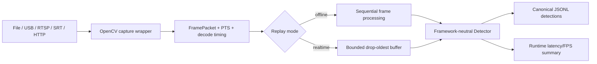

# M1 video replay progress report

Date: 2026-07-30  
Branch: `develop`

## Outcome

The first executable M1 slice now supports deterministic offline video detection and freshness-first live ingestion.
It intentionally separates correctness/evaluation metadata from volatile runtime performance data.

## Implemented

- Normalized source parsing for local files, numeric camera devices, RTSP, SRT, and HTTP(S).
- Local existence checks only for file sources; stream URLs are never passed through `Path.exists()`.
- OpenCV capture wrapper with FFmpeg/GStreamer/automatic backend selection.
- Open/read timeout parameters for network sources.
- Hardware decode preference with software fallback when the OpenCV build supports acceleration properties.
- Frame ID, media PTS, estimated capture timestamp, decode completion timestamp, and decode duration.
- Deterministic file timeline anchored at the Unix epoch, derived from media PTS with FPS fallback.
- Exponential backoff and configurable reconnect budget for device and network sources.
- Bad-frame rejection and reader counters for opens, failures, decoded frames, and reconnect attempts.
- Threaded producer with bounded drop-oldest buffering for real-time freshness.
- Sequential offline mode that does not skip frames and does not accumulate detector results in memory.
- Canonical JSONL detection records independent of Ultralytics result types.
- Separate performance summary with throughput, decode P50/P95, inference P50/P95/P99, queue drops, and SHA-256.
- `seahunter-video-replay` CLI for file and live-source processing.

## Data flow

## Verification

- Synthetic MJPG video is generated during tests and decoded end to end through the replay service.
- Offline replay is executed twice and produces byte-identical JSONL and matching SHA-256 digests.
- Mocked RTSP/SRT failures verify reconnect success and reconnect-budget exhaustion.
- A fast producer test verifies that a capacity-two queue retains only the latest two of five frames.
- Ruff lint/format and strict mypy checks pass for the new system code.
- Framework-neutral suite: 35 tests passed.
- Legacy detector video replay is covered by an opt-in CPU model test using `SEAHUNTER_RUN_MODEL_TESTS=1`.

## Remaining M1 work

- Verify that the target NVIDIA/OpenCV or GStreamer build actually selects NVDEC; requesting acceleration is not
  sufficient evidence.
- Add annotated-video output and a basic WebSocket preview service.
- Add Parquet output for large offline evaluation runs.
- Add process RSS, GPU memory, utilization, power, and temperature monitoring.
- Run sustained 1080p benchmarks and record end-to-end P95/FPS on the target edge device.
- Execute disconnect/recovery soak tests against a real RTSP camera or controlled proxy.

## External constraints

- No NVIDIA/CUDA target is attached, so NVDEC and TensorRT performance cannot be accepted yet.
- No fixed real maritime replay corpus is present, so the current replay gate uses deterministic synthetic video.
