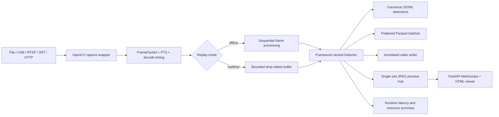

# M1 video replay progress report

Date: 2026-07-30  
Branch: `develop`

## Outcome

The executable M1 pipeline now supports deterministic offline video detection, freshness-first live ingestion,
operator preview, visual recording, columnar evaluation output, and process/device monitoring. It intentionally
separates correctness/evaluation metadata from volatile runtime performance data.

## Implemented

- Normalized source parsing for local files, numeric camera devices, RTSP, SRT, and HTTP(S).
- Local existence checks only for file sources; stream URLs are never passed through `Path.exists()`.
- OpenCV capture wrapper with FFmpeg/GStreamer/automatic backend selection.
- Open/read timeout parameters for network sources.
- Hardware decode preference with software fallback when the OpenCV build supports acceleration properties.
- Machine-readable OpenCV build capability audit for FFmpeg, GStreamer, CUDA visibility, and capture properties.
- Per-source decoder selection audit with the requested/selected backend, effective acceleration API, hardware device,
  and explicit software-fallback reason. Generic OpenCV acceleration never sets `nvdec_verified=true`.
- Frame ID, media PTS, estimated capture timestamp, decode completion timestamp, and decode duration.
- Deterministic file timeline anchored at the Unix epoch, derived from media PTS with FPS fallback.
- Exponential backoff and configurable reconnect budget for device and network sources.
- Bad-frame rejection and reader counters for opens, failures, decoded frames, and reconnect attempts.
- Threaded producer with bounded drop-oldest buffering for real-time freshness.
- Sequential offline mode that does not skip frames and does not accumulate detector results in memory.
- Canonical JSONL detection records independent of Ultralytics result types.
- Separate performance summary with throughput, decode P50/P95, inference P50/P95/P99, queue drops, and SHA-256.
- Versioned `FrameResult` and `FrameResultSink` contracts for independent downstream outputs.
- Flattened, bounded-batch Parquet output with explicit empty-frame rows for offline evaluation.
- Annotated video output with class labels, confidence, frame ID, inference time, and dropped-frame overlay.
- Single-slot annotated JPEG preview hub that drops superseded preview frames instead of accumulating them.
- FastAPI/Uvicorn edge preview with HTML viewer, `/health`, `/metrics`, and `/ws/preview` endpoints.
- Process RSS/CPU/system-memory sampling through psutil and optional NVIDIA memory/utilization/temperature/power
  sampling through `nvidia-smi`.
- `seahunter-video-replay` CLI for file and live-source processing.
- `seahunter-edge-service` prototype with real-time, WebSocket preview, and always-reconnect defaults.

## Data flow

## Verification

- Synthetic MJPG video is generated during tests and decoded end to end through the replay service.
- Offline replay is executed twice and produces byte-identical JSONL and matching SHA-256 digests.
- Mocked RTSP/SRT failures verify reconnect success and reconnect-budget exhaustion.
- A fast producer test verifies that a capacity-two queue retains only the latest two of five frames.
- One synthetic replay simultaneously writes JSONL, Parquet, annotated video, and latest-frame JPEG preview output.
- FastAPI health, metrics, HTML, and WebSocket frame delivery are covered through an in-process client.
- A real background Uvicorn smoke test returned HTTP 200 from `/health` and shut down its server thread cleanly.
- Resource sampling tests verify interval gating, peak aggregation, and non-fatal provider failures.
- CLI validation rejects output-path collisions and any attempt to overwrite a local input video.
- Deterministic mocked decoder tests distinguish a hardware-open failure followed by software recovery from an
  effective acceleration selection, while keeping NVDEC unverified in both cases.
- Ruff lint/format and strict mypy checks pass for the new system code.
- Framework-neutral suite: 48 tests passed.
- Legacy detector video replay is covered by an opt-in CPU model test using `SEAHUNTER_RUN_MODEL_TESTS=1`.

## Remaining M1 work

- Verify that the target NVIDIA/OpenCV or GStreamer build actually selects NVDEC; requesting acceleration is not
  sufficient evidence.
- Run sustained 1080p benchmarks and record end-to-end P95/FPS on the target edge device.
- Execute disconnect/recovery soak tests against a real RTSP camera or controlled proxy.
- Add authentication/TLS and an external metrics exporter before exposing preview outside a controlled edge network.

## External constraints

- No NVIDIA/CUDA target is attached, so NVDEC and TensorRT performance cannot be accepted yet.
- No fixed real maritime replay corpus is present, so the current replay gate uses deterministic synthetic video.
